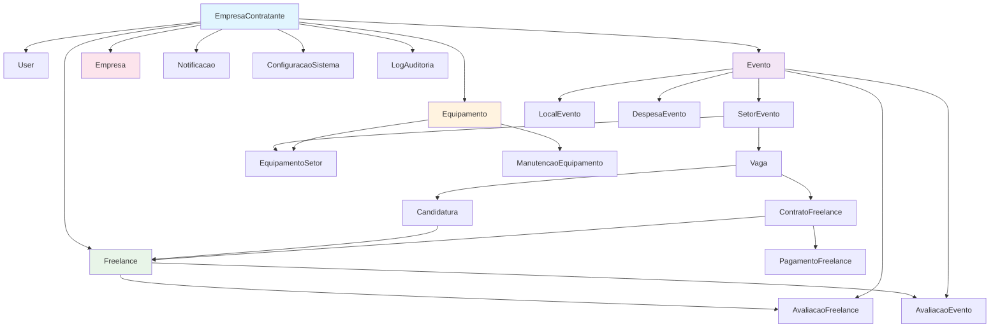
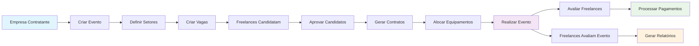
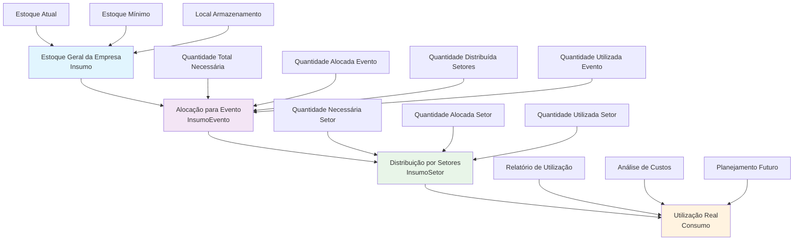
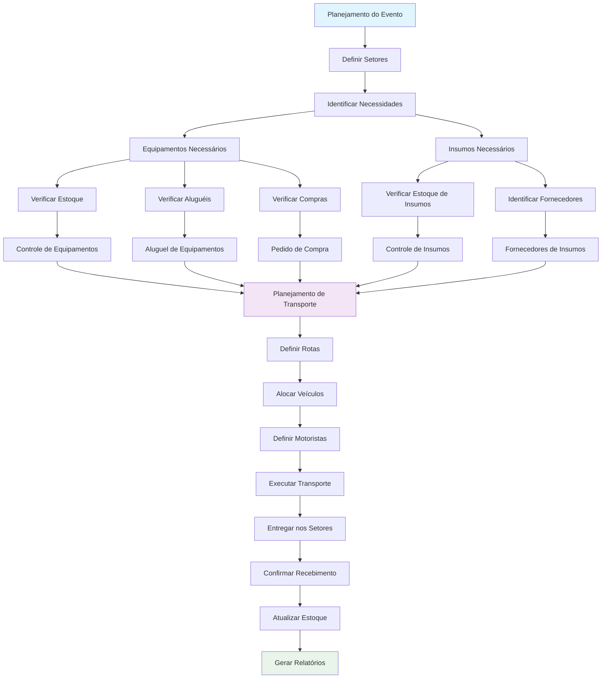
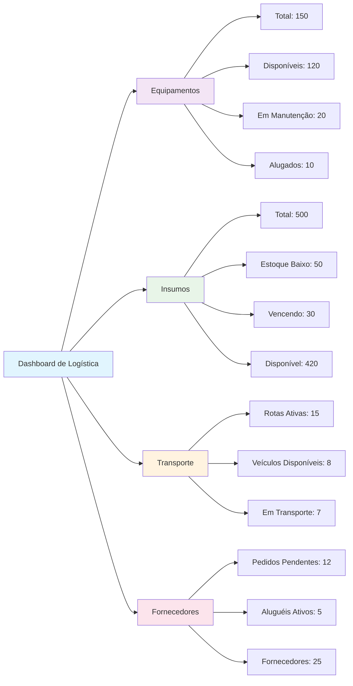

# Diagrama da Estrutura de Modelos - Sistema Eventix

## Diagrama Principal dos Modelos

```mermaid
erDiagram
    %% Modelo Base - Empresa Contratante
    EmpresaContratante {
        int id PK
        string nome
        string cnpj UK
        string razao_social
        string nome_fantasia
        string telefone
        string email
        string website
        string cep
        string logradouro
        string numero
        string complemento
        string bairro
        string cidade
        string uf
        date data_contratacao
        date data_vencimento
        string plano_contratado
        decimal valor_mensal
        boolean ativo
        datetime data_atualizacao
    }

    %% Usuários e Autenticação
    User {
        int id PK
        string username UK
        string email
        string tipo_usuario
        int empresa_contratante_id FK
        boolean ativo
        datetime data_ultimo_acesso
    }

    %% Empresas Parceiras
    TipoEmpresa {
        int id PK
        string nome UK
        text descricao
    }

    Empresa {
        int id PK
        int empresa_contratante_id FK
        string nome
        string cnpj
        int tipo_empresa_id FK
        string telefone
        string email
        boolean ativo
    }

    %% Eventos
    LocalEvento {
        int id PK
        string nome
        string endereco
        int capacidade
        int empresa_contratante_id FK
        int empresa_proprietaria_id FK
        boolean ativo
    }

    Evento {
        int id PK
        int empresa_contratante_id FK
        string nome
        date data_inicio
        date data_fim
        text descricao
        int local_id FK
        int empresa_produtora_id FK
        int empresa_contratante_mao_obra_id FK
        boolean ativo
        datetime data_criacao
    }

    SetorEvento {
        int id PK
        int evento_id FK
        string nome
        text descricao
        boolean ativo
    }

    %% Equipamentos
    CategoriaEquipamento {
        int id PK
        int empresa_contratante_id FK
        string nome
        text descricao
        boolean ativo
    }

    Equipamento {
        int id PK
        int empresa_contratante_id FK
        int empresa_proprietaria_id FK
        string codigo_patrimonial
        int categoria_id FK
        text descricao
        text especificacoes_tecnicas
        string marca
        string modelo
        string numero_serie
        date data_aquisicao
        decimal valor_aquisicao
        string estado_conservacao
        string foto
        string manual_instrucoes
        boolean ativo
        datetime criado_em
        datetime atualizado_em
    }

    EquipamentoSetor {
        int id PK
        int setor_id FK
        int equipamento_id FK
        int quantidade_necessaria
        int quantidade_disponivel
        text observacoes
        datetime data_inicio_uso
        datetime data_fim_uso
        int responsavel_equipamento_id FK
        string status
        datetime criado_em
        datetime atualizado_em
    }

    ManutencaoEquipamento {
        int id PK
        int equipamento_id FK
        string tipo_manutencao
        text descricao
        date data_inicio
        date data_fim
        decimal custo
        string fornecedor
        int responsavel_id FK
        string status
        text observacoes
        datetime criado_em
    }

    %% Recursos Humanos
    Freelance {
        int id PK
        int usuario_id FK UK
        string nome_completo
        string telefone
        string documento
        text habilidades
        string cpf UK
        string rg
        string orgao_expedidor
        string uf_rg
        date data_nascimento
        string sexo
        string estado_civil
        string nacionalidade
        string naturalidade
        string nome_mae
        string nome_pai
        string foto
        string cep
        string logradouro
        string numero
        string complemento
        string bairro
        string cidade
        string uf
        string pis_pasep
        string carteira_trabalho_numero
        string carteira_trabalho_serie
        string titulo_eleitor
        string cnh_numero
        string cnh_categoria
        string certificado_reservista
        string banco
        string agencia
        string conta
        string tipo_conta
        string chave_pix
        string arquivo_exame_medico
        string arquivo_comprovante_residencia
        string arquivo_identidade_frente
        string arquivo_identidade_verso
        text observacoes
        text observacoes_medicas
        datetime atualizado_em
        boolean cadastro_completo
    }

    Vaga {
        int id PK
        int setor_id FK
        string titulo
        int quantidade
        decimal remuneracao
        text descricao
        boolean ativa
    }

    Candidatura {
        int id PK
        int freelance_id FK
        int vaga_id FK
        datetime data_candidatura
        string status
    }

    ContratoFreelance {
        int id PK
        int freelance_id FK
        int vaga_id FK
        datetime data_contratacao
        string status
    }

    %% Sistema Financeiro
    FormaPagamento {
        int id PK
        int empresa_contratante_id FK
        string nome
        text descricao
        boolean ativo
    }

    PagamentoFreelance {
        int id PK
        int empresa_contratante_id FK
        int freelance_id FK
        int contrato_id FK
        decimal valor
        int forma_pagamento_id FK
        date data_pagamento
        date data_vencimento
        string status
        text observacoes
        string comprovante
        datetime criado_em
        datetime atualizado_em
    }

    DespesaEvento {
        int id PK
        int empresa_contratante_id FK
        int evento_id FK
        string descricao
        string tipo_despesa
        decimal valor
        string fornecedor
        date data_despesa
        int forma_pagamento_id FK
        string comprovante
        text observacoes
        datetime criado_em
    }

    %% Avaliações
    AvaliacaoFreelance {
        int id PK
        int empresa_contratante_id FK
        int freelance_id FK
        int evento_id FK
        int avaliador_id FK
        int nota_desempenho
        int nota_pontualidade
        int nota_profissionalismo
        text comentarios
        boolean recomendaria
        datetime data_avaliacao
    }

    AvaliacaoEvento {
        int id PK
        int empresa_contratante_id FK
        int evento_id FK
        int freelance_id FK
        int nota_organizacao
        int nota_condicoes_trabalho
        int nota_remuneracao
        text comentarios
        boolean recomendaria
        datetime data_avaliacao
    }

    %% Notificações
    TipoNotificacao {
        int id PK
        string nome
        text descricao
        string template_titulo
        text template_mensagem
        boolean ativo
    }

    Notificacao {
        int id PK
        int empresa_contratante_id FK
        int destinatario_id FK
        int tipo_id FK
        string titulo
        text mensagem
        string prioridade
        boolean lida
        datetime data_envio
        datetime data_leitura
        string link_relacionado
    }

    %% Comunicação
    CanalComunicacao {
        int id PK
        int empresa_contratante_id FK
        string nome
        text descricao
        string tipo
        boolean ativo
    }

    Mensagem {
        int id PK
        int empresa_contratante_id FK
        int remetente_id FK
        int canal_id FK
        string assunto
        text conteudo
        string prioridade
        string status
        datetime data_envio
        datetime data_leitura
        string anexos
        datetime criado_em
    }

    %% Checklists e Tarefas
    ChecklistEvento {
        int id PK
        int empresa_contratante_id FK
        int evento_id FK
        string titulo
        text descricao
        int responsavel_id FK
        datetime data_limite
        boolean concluido
        datetime data_conclusao
        datetime criado_em
    }

    ItemChecklist {
        int id PK
        int checklist_id FK
        string descricao
        int ordem
        int responsavel_id FK
        boolean concluido
        datetime data_conclusao
        text observacoes
    }

    Tarefa {
        int id PK
        int empresa_contratante_id FK
        string titulo
        text descricao
        int responsavel_id FK
        int criado_por_id FK
        string prioridade
        string status
        datetime data_criacao
        datetime data_limite
        datetime data_conclusao
        int evento_relacionado_id FK
    }

    %% Templates e Documentos
    TemplateDocumento {
        int id PK
        int empresa_contratante_id FK
        string nome
        string tipo_documento
        text descricao
        text conteudo
        json variaveis
        boolean ativo
        int criado_por_id FK
        datetime criado_em
        datetime atualizado_em
    }

    DocumentoGerado {
        int id PK
        int template_id FK
        string titulo
        text conteudo
        string arquivo
        json variaveis_utilizadas
        int gerado_por_id FK
        int evento_relacionado_id FK
        datetime data_geracao
    }

    %% Relatórios e Estatísticas
    RelatorioEvento {
        int id PK
        int empresa_contratante_id FK
        int evento_id FK
        string tipo_relatorio
        string titulo
        text descricao
        string arquivo
        int gerado_por_id FK
        datetime data_geracao
    }

    EstatisticaEmpresa {
        int id PK
        int empresa_contratante_id FK UK
        int total_eventos
        int total_freelances
        int total_equipamentos
        decimal receita_total
        decimal despesa_total
        datetime data_atualizacao
    }

    %% Configurações
    ConfiguracaoSistema {
        int id PK
        int empresa_contratante_id FK UK
        boolean notificacoes_email
        boolean notificacoes_push
        boolean notificacoes_sms
        int tempo_sessao_horas
        int max_tentativas_login
        boolean exigir_senha_forte
        boolean gerar_relatorios_automaticos
        string frequencia_relatorios
        boolean backup_automatico
        string frequencia_backup
        datetime data_atualizacao
    }

    ConfiguracaoEmpresa {
        int id PK
        int empresa_contratante_id FK UK
        int max_eventos_simultaneos
        int prazo_cancelamento_horas
        boolean exigir_documentos_completos
        boolean avaliacao_obrigatoria
        boolean controle_estoque_automatico
        int alerta_manutencao_dias
        int prazo_pagamento_dias
        decimal multa_atraso_percentual
        datetime data_atualizacao
    }

    %% Auditoria e Logs
    LogAuditoria {
        int id PK
        int empresa_contratante_id FK
        int usuario_id FK
        string acao
        string modelo
        int objeto_id
        text descricao
        string ip_address
        text user_agent
        datetime data_hora
    }

    %% Integrações
    IntegracaoAPI {
        int id PK
        int empresa_contratante_id FK
        string nome
        string tipo_integracao
        string url_base
        string api_key
        string api_secret
        json configuracoes
        boolean ativo
        datetime ultima_sincronizacao
        datetime criado_em
    }

    LogIntegracao {
        int id PK
        int integracao_id FK
        string acao
        string status
        json dados_enviados
        json resposta_recebida
        text erro
        float tempo_resposta
        datetime data_hora
    }

    %% Backup e Versionamento
    BackupSistema {
        int id PK
        int empresa_contratante_id FK
        string tipo_backup
        string arquivo_backup
        bigint tamanho_arquivo
        string status
        datetime data_inicio
        datetime data_conclusao
        text observacoes
    }

    VersaoSistema {
        int id PK
        string numero_versao UK
        string nome_versao
        date data_lancamento
        text descricao
        json mudancas
        boolean ativo
        boolean obrigatorio
        datetime criado_em
    }

    %% Relacionamentos
    EmpresaContratante ||--o{ User : "usuarios"
    EmpresaContratante ||--o{ Empresa : "empresas_parceiras"
    Empresa ||--o{ LocalEvento : "locais"
    EmpresaContratante ||--o{ Evento : "eventos"
    EmpresaContratante ||--o{ CategoriaEquipamento : "categorias_equipamentos"
    EmpresaContratante ||--o{ Equipamento : "equipamentos"
    EmpresaContratante ||--o{ FormaPagamento : "formas_pagamento"
    EmpresaContratante ||--o{ PagamentoFreelance : "pagamentos_freelances"
    EmpresaContratante ||--o{ DespesaEvento : "despesas_eventos"
    EmpresaContratante ||--o{ AvaliacaoFreelance : "avaliacoes_freelances"
    EmpresaContratante ||--o{ AvaliacaoEvento : "avaliacoes_eventos"
    EmpresaContratante ||--o{ Notificacao : "notificacoes"
    EmpresaContratante ||--o{ CanalComunicacao : "canais_comunicacao"
    EmpresaContratante ||--o{ Mensagem : "mensagens"
    EmpresaContratante ||--o{ ChecklistEvento : "checklists_eventos"
    EmpresaContratante ||--o{ Tarefa : "tarefas"
    EmpresaContratante ||--o{ TemplateDocumento : "templates_documentos"
    EmpresaContratante ||--o{ RelatorioEvento : "relatorios_eventos"
    EmpresaContratante ||--|| EstatisticaEmpresa : "estatisticas"
    EmpresaContratante ||--|| ConfiguracaoSistema : "configuracao_sistema"
    EmpresaContratante ||--|| ConfiguracaoEmpresa : "configuracao_empresa"
    EmpresaContratante ||--o{ LogAuditoria : "logs_auditoria"
    EmpresaContratante ||--o{ IntegracaoAPI : "integracoes_api"
    EmpresaContratante ||--o{ BackupSistema : "backups"

    TipoEmpresa ||--o{ Empresa : "empresas"
    Empresa ||--o{ LocalEvento : "locais"
    Empresa ||--o{ Equipamento : "equipamentos"
    Empresa ||--o{ Evento : "eventos_produzidos"
    Empresa ||--o{ Evento : "eventos_contratados"

    User ||--|| Freelance : "freelance"
    User ||--o{ AvaliacaoFreelance : "avaliacoes_realizadas"
    User ||--o{ Notificacao : "notificacoes_recebidas"
    User ||--o{ Mensagem : "mensagens_enviadas"
    User ||--o{ Mensagem : "mensagens_recebidas"
    User ||--o{ ChecklistEvento : "checklists_responsavel"
    User ||--o{ ItemChecklist : "itens_checklist_responsavel"
    User ||--o{ Tarefa : "tarefas_responsavel"
    User ||--o{ Tarefa : "tarefas_criadas"
    User ||--o{ TemplateDocumento : "templates_criados"
    User ||--o{ DocumentoGerado : "documentos_gerados"
    User ||--o{ RelatorioEvento : "relatorios_gerados"
    User ||--o{ LogAuditoria : "logs_auditoria"

    Evento ||--o{ SetorEvento : "setores"
    Evento ||--o{ AvaliacaoFreelance : "avaliacoes_freelances"
    Evento ||--o{ AvaliacaoEvento : "avaliacoes_recebidas"
    Evento ||--o{ DespesaEvento : "despesas"
    Evento ||--o{ ChecklistEvento : "checklists"
    Evento ||--o{ Tarefa : "tarefas"
    Evento ||--o{ DocumentoGerado : "documentos"
    Evento ||--o{ RelatorioEvento : "relatorios"

    LocalEvento ||--o{ Evento : "eventos"

    SetorEvento ||--o{ Vaga : "vagas"
    SetorEvento ||--o{ EquipamentoSetor : "equipamentos_setor"

    CategoriaEquipamento ||--o{ Equipamento : "equipamentos"

    Equipamento ||--o{ EquipamentoSetor : "setores_utilizacao"
    Equipamento ||--o{ ManutencaoEquipamento : "manutencoes"

    Freelance ||--o{ Candidatura : "candidaturas_pendentes"
    Freelance ||--o{ ContratoFreelance : "contratacoes"
    Freelance ||--o{ PagamentoFreelance : "pagamentos_recebidos"
    Freelance ||--o{ AvaliacaoFreelance : "avaliacoes_recebidas"
    Freelance ||--o{ AvaliacaoEvento : "avaliacoes_eventos_realizadas"
    Freelance ||--o{ EquipamentoSetor : "equipamentos_responsavel"
    Freelance ||--o{ ManutencaoEquipamento : "manutencoes_realizadas"

    Vaga ||--o{ Candidatura : "candidaturas"
    Vaga ||--o{ ContratoFreelance : "freelances_contratados"

    ContratoFreelance ||--o{ PagamentoFreelance : "pagamentos"

    FormaPagamento ||--o{ PagamentoFreelance : "pagamentos"
    FormaPagamento ||--o{ DespesaEvento : "despesas"

    TipoNotificacao ||--o{ Notificacao : "notificacoes"

    CanalComunicacao ||--o{ Mensagem : "mensagens"

    ChecklistEvento ||--o{ ItemChecklist : "itens"

    TemplateDocumento ||--o{ DocumentoGerado : "documentos_gerados"

    IntegracaoAPI ||--o{ LogIntegracao : "logs"
```

## Diagrama de Relacionamentos Principais



## Fluxo de Dados Principal



Este diagrama mostra a estrutura completa do banco de dados do sistema Eventix, com todos os relacionamentos entre as entidades principais. A arquitetura multi-tenant é mantida através do relacionamento central com `EmpresaContratante`.

## Novos Modelos de Estoque e Transporte

```mermaid
erDiagram
    %% Modelos de Estoque e Insumos
    CategoriaInsumo {
        int id PK
        int empresa_contratante_id FK
        string nome
        text descricao
        boolean ativo
    }

    Insumo {
        int id PK
        int empresa_contratante_id FK
        int empresa_fornecedora_id FK
        string codigo
        int categoria_id FK
        string nome
        text descricao
        text especificacoes
        string unidade_medida
        decimal preco_unitario
        int estoque_minimo
        int estoque_atual
        string local_armazenamento
        date data_validade
        string foto
        boolean ativo
        datetime criado_em
        datetime atualizado_em
    }

    InsumoEvento {
        int id PK
        int evento_id FK
        int insumo_id FK
        int quantidade_total_necessaria
        int quantidade_alocada_evento
        int quantidade_distribuida_setores
        int quantidade_utilizada_evento
        datetime data_alocacao
        int responsavel_alocacao_id FK
        text observacoes
        string status
        datetime criado_em
        datetime atualizado_em
    }

    InsumoSetor {
        int id PK
        int setor_id FK
        int insumo_evento_id FK
        int quantidade_necessaria
        int quantidade_alocada
        int quantidade_transportada
        int quantidade_utilizada
        text observacoes
        datetime data_necessidade
        int responsavel_insumo_id FK
        string status
        datetime criado_em
        datetime atualizado_em
    }

    %% Modelos de Transporte
    TipoVeiculo {
        int id PK
        int empresa_contratante_id FK
        string nome
        text descricao
        decimal capacidade_carga
        decimal capacidade_volume
        boolean ativo
    }

    Veiculo {
        int id PK
        int empresa_contratante_id FK
        int empresa_proprietaria_id FK
        int tipo_veiculo_id FK
        string placa UK
        string modelo
        int ano
        string cor
        int motorista_responsavel_id FK
        string status
        text observacoes
        boolean ativo
    }

    RotaTransporte {
        int id PK
        int empresa_contratante_id FK
        int evento_id FK
        string nome_rota
        string origem
        string destino
        int veiculo_id FK
        int motorista_id FK
        datetime data_saida
        datetime data_chegada_prevista
        datetime data_chegada_real
        decimal distancia_km
        decimal custo_combustivel
        decimal custo_pedagio
        string status
        text observacoes
        datetime criado_em
    }

    ItemTransporte {
        int id PK
        int rota_id FK
        string tipo_item
        int equipamento_id FK
        int insumo_id FK
        int quantidade
        decimal peso_unitario
        decimal volume_unitario
        int setor_destino_id FK
        text observacoes
    }

    %% Modelos de Controle Avançado de Equipamentos
    StatusEquipamento {
        int id PK
        int empresa_contratante_id FK
        string nome
        text descricao
        string cor
        boolean ativo
    }

    ControleEquipamento {
        int id PK
        int empresa_contratante_id FK
        int equipamento_id FK
        string tipo_controle
        int status_equipamento_id FK
        int quantidade_atual
        int quantidade_necessaria
        int quantidade_em_manutencao
        int quantidade_para_comprar
        int quantidade_alugada
        datetime data_ultima_verificacao
        datetime proxima_verificacao
        text observacoes
        int responsavel_id FK
        datetime criado_em
        datetime atualizado_em
    }

    PedidoCompraEquipamento {
        int id PK
        int empresa_contratante_id FK
        string numero_pedido UK
        int fornecedor_id FK
        int equipamento_id FK
        int quantidade
        decimal valor_unitario
        decimal valor_total
        date data_pedido
        date data_entrega_prevista
        date data_entrega_real
        string status
        text observacoes
        int solicitante_id FK
        int aprovador_id FK
        datetime criado_em
    }

    AluguelEquipamento {
        int id PK
        int empresa_contratante_id FK
        int equipamento_id FK
        int fornecedor_aluguel_id FK
        int quantidade
        decimal valor_diario
        date data_inicio
        date data_fim
        date data_devolucao
        string status
        decimal valor_total
        text observacoes
        int solicitante_id FK
        datetime criado_em
    }

    %% Modelos de Relatórios de Estoque
    RelatorioEstoque {
        int id PK
        int empresa_contratante_id FK
        int evento_id FK
        string tipo_relatorio
        string titulo
        text descricao
        json dados_relatorio
        string arquivo
        int gerado_por_id FK
        datetime data_geracao
    }

    DashboardEstoque {
        int id PK
        int empresa_contratante_id FK UK
        int total_equipamentos
        int equipamentos_disponiveis
        int equipamentos_manutencao
        int equipamentos_alugados
        int total_insumos
        int insumos_estoque_baixo
        int insumos_vencendo
        int rotas_transporte_ativas
        int veiculos_disponiveis
        int pedidos_compra_pendentes
        int alugueis_ativos
        datetime data_atualizacao
    }

    %% Relacionamentos dos Novos Modelos
    EmpresaContratante ||--o{ CategoriaInsumo : "categorias_insumos"
    EmpresaContratante ||--o{ Insumo : "insumos"
    EmpresaContratante ||--o{ TipoVeiculo : "tipos_veiculos"
    EmpresaContratante ||--o{ Veiculo : "veiculos"
    EmpresaContratante ||--o{ RotaTransporte : "rotas_transporte"
    EmpresaContratante ||--o{ StatusEquipamento : "status_equipamentos"
    EmpresaContratante ||--o{ ControleEquipamento : "controles_equipamentos"
    EmpresaContratante ||--o{ PedidoCompraEquipamento : "pedidos_compra_equipamentos"
    EmpresaContratante ||--o{ AluguelEquipamento : "alugueis_equipamentos"
    EmpresaContratante ||--o{ RelatorioEstoque : "relatorios_estoque"
    EmpresaContratante ||--|| DashboardEstoque : "dashboard_estoque"

    CategoriaInsumo ||--o{ Insumo : "insumos"
    Insumo ||--o{ InsumoEvento : "eventos_utilizacao"
    Insumo ||--o{ ItemTransporte : "transportes"
    
    Evento ||--o{ InsumoEvento : "insumos_evento"
    InsumoEvento ||--o{ InsumoSetor : "setores_distribuicao"

    SetorEvento ||--o{ InsumoSetor : "insumos_setor"
    SetorEvento ||--o{ ItemTransporte : "itens_recebidos"

    TipoVeiculo ||--o{ Veiculo : "veiculos"
    Veiculo ||--o{ RotaTransporte : "rotas"

    RotaTransporte ||--o{ ItemTransporte : "itens_transporte"

    StatusEquipamento ||--o{ ControleEquipamento : "controles"
    Equipamento ||--o{ ControleEquipamento : "controles"
    Equipamento ||--o{ PedidoCompraEquipamento : "pedidos_compra"
    Equipamento ||--o{ AluguelEquipamento : "alugueis"
    Equipamento ||--o{ ItemTransporte : "transportes"

    Empresa ||--o{ Insumo : "insumos_fornecidos"
    Empresa ||--o{ Veiculo : "veiculos"
    Empresa ||--o{ PedidoCompraEquipamento : "pedidos_fornecidos"
    Empresa ||--o{ AluguelEquipamento : "equipamentos_alugados"

    Freelance ||--o{ InsumoSetor : "insumos_responsavel"
    User ||--o{ InsumoEvento : "insumos_alocados"
    Freelance ||--o{ Veiculo : "veiculos_responsavel"
    Freelance ||--o{ RotaTransporte : "rotas_motorista"
    Freelance ||--o{ ControleEquipamento : "controles_equipamentos_responsavel"

    User ||--o{ PedidoCompraEquipamento : "pedidos_compra_solicitados"
    User ||--o{ PedidoCompraEquipamento : "pedidos_compra_aprovados"
    User ||--o{ AluguelEquipamento : "alugueis_solicitados"
    User ||--o{ RelatorioEstoque : "relatorios_estoque_gerados"

    Evento ||--o{ RotaTransporte : "rotas_transporte"
    Evento ||--o{ RelatorioEstoque : "relatorios_estoque"
```

## Fluxo de Estoque Hierárquico



## Fluxo de Logística Completo



## Dashboard de Logística



Esta expansão do diagrama mostra como os novos modelos de estoque e transporte se integram ao sistema existente, criando um fluxo completo de logística para eventos.
